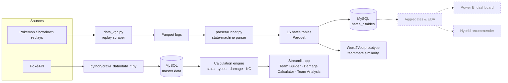

# Pokémon Competitive Analytics (VGC)

[](https://github.com/hoangphuc082602/Pokemon-Competitive-Analysis/actions/workflows/ci.yml)


An end-to-end data project built around **Pokémon VGC** (Level 50 doubles battles). Instead of analysing a ready-made dataset, it covers the whole data lifecycle:

> collect → normalise → model → parse / ETL → store (Parquet + MySQL) → calculate → analyse → recommend

It combines a **battle-log parsing pipeline** (millions of Pokémon Showdown replays), a **rules-accurate calculation engine** (stats, type effectiveness, damage, KO chances) and a **Streamlit app** for building and analysing teams.

## Highlights

- **Real-scale data.** 3.5M+ parsed battles and ~80M move events from ~20 VGC formats (Regulation D 2023 → Champions Reg M-A 2026).
- **Hand-written state-machine parser.** Turns raw Showdown logs into 15 relational tables, streaming to Parquet in batches so memory stays flat (multi-process, `--dry-run`, error report for unparsable logs).
- **Calculation engine with ability interactions.** Level 50 stats (IV / EV / Nature), STAB (including ability-converted move types), type chart with ability immunities / resistances, Scrappy, Mold Breaker, `-ate` abilities, damage rolls and OHKO / 2HKO probabilities.
- **Tested core.** The unit test suite runs without a database, on a small in-memory type chart and reference stat values.

## Scale

The figures below come from the author's local MySQL instance. **The datasets are not stored in this repository**; they are rebuilt with the pipeline described in [Getting started](#getting-started).

| Battle data (Showdown replays) | Rows | Master data (PokéAPI) | Rows |
|---|---:|---|---:|
| `battle` | 3,556,309 | `pokemon_species` | 1,025 |
| `battle_team_slot` | 42,505,674 | `moves` | 919 |
| `battle_move` | 80,633,080 | `ability` | 311 |
| `battle_damage` | 72,327,697 | `item` | 2,120 |
| `battle_switch` | 23,446,990 | `pokemon_moves` (learnsets) | 45,969 |
| `battle_faint` | 19,535,719 | `type_effectiveness` | 120 |

## Architecture



Dashed boxes are planned, not built yet. Game mechanics (PokéAPI, deterministic rules) and competitive statistics (Showdown, empirical observations) are kept separate on purpose: a Pokémon being popular does not mean it is mechanically stronger.

## Project status

| Area | Status | Notes |
|---|---|---|
| PokéAPI crawlers → MySQL master data | Done | 16 scripts, each writes a CSV and loads one table |
| Showdown replay scraper | Done | 20 VGC formats; requires `poke-env` |
| Battle-log parser (15 tables, Parquet) | Done | Runs in parallel, writes incrementally |
| Calculation engine | Core done | See [limitations](#known-limitations) |
| Streamlit app | Prototype | Team Builder, Damage Calculator, Team Analysis |
| Unit tests | Passing in CI | No database needed |
| CI (GitHub Actions) | Configured | Runs `pytest` on every push to `main` and every pull request |
| Aggregate tables, EDA, Power BI | Planned | Tables are designed but not populated yet |
| Recommendation | Prototype | Word2Vec teammate similarity, not evaluated |

## Tech stack

Python · pandas · NumPy · PyArrow / Parquet · SQLAlchemy + PyMySQL · MySQL · Streamlit · Gensim (Word2Vec) · pytest · GitHub Actions. Power BI is planned for the dashboard layer.

## Repository layout

```text
.
├── python/
│   ├── crawl_data/        # PokéAPI crawlers (data_*.py) and the replay scraper (data_vgc.py)
│   ├── calculations/      # stats, nature, type chart, damage, KO %, speed, roles, team validation
│   ├── database/          # db_connection.py (reads .env) and table loaders
│   ├── models/            # build_pokemon(): final stats from species + nature + EV / IV
│   ├── services/          # team persistence (save / load teams)
│   ├── recommendation/    # rule-based role recommender (early prototype)
│   ├── ml/                # team feature helpers
│   ├── untils/            # shared constants
│   └── test/              # pytest suite (99 tests)
├── parser/                # battle-log state machine and the batch runner
├── src/                   # Word2Vec prototype (team generator, training, similarity query)
├── streamlit_app/         # app.py and pages/
├── models/                # trained Word2Vec model
├── schema.sql             # table / column overview of the MySQL schema
├── requirements.txt       # runtime dependencies
└── requirements-dev.txt   # + pytest
```

## Getting started

### 1. Install and run the tests (no database needed)

```bash
git clone https://github.com/hoangphuc082602/Pokemon-Competitive-Analysis.git
cd Pokemon-Competitive-Analysis

python -m venv venv
# Windows: venv\Scripts\activate      macOS / Linux: source venv/bin/activate
pip install -r requirements-dev.txt

pytest
```

### 2. Configure the database

Create an empty MySQL database (default name `pokemon_analytics`), then copy the example environment file and edit it:

```bash
cp .env.example .env
```

| Variable | Default | Meaning |
|---|---|---|
| `DB_HOST` | `localhost` | MySQL host |
| `DB_PORT` | `3306` | MySQL port |
| `DB_USER` | `root` | MySQL user |
| `DB_PASSWORD` | – | MySQL password |
| `DB_NAME` | `pokemon_analytics` | Database name |

`.env` is git-ignored. No credentials live in the code.

### 3. Build the master data

Each script downloads one PokéAPI entity, writes `data/raw/<name>.csv` and loads the matching MySQL table. Run them from the repository root:

```bash
python -m python.crawl_data.data_type
python -m python.crawl_data.data_pokemon
# ... one script per entity in python/crawl_data/
```

### 4. Run the app

```bash
streamlit run streamlit_app/app.py
```

The app reads the master data from MySQL, so step 3 must be done first.

### 5. Battle-log pipeline (optional)

```bash
pip install poke-env                                  # only needed for the replay scraper
python -m python.crawl_data.data_vgc --num_workers 4  # scrape replay logs
python parser/runner.py --workers 4                   # data/vgc_data/*.parquet -> data/output/<table>.parquet
python parser/runner.py --help                        # all options (batch size, log column, --dry-run ...)
```

Loading the output Parquet files into MySQL is currently done with a local script that is not part of this repository yet (see the roadmap).

## Testing

```bash
pytest
```

The suite targets the deterministic core and needs neither MySQL nor network access:

- stat and Nature formulas against reference Level 50 values
- type chart and ability interactions (immunities, resistances, Scrappy, Mold Breaker, `-ate` and Normalize)
- damage, STAB and KO probability, with the damage roll fixed so tests are repeatable
- team defensive / offensive coverage, role labelling and team validation (duplicate Pokémon / items, illegal moves)

## Known limitations

These are tracked openly rather than hidden:

- **Damage calculator** does not model spread moves, critical hits, weather, burn, item and ability damage modifiers, Tera STAB or stat stages yet. Wind Rider's immunity to wind moves is not modelled either (it needs a list of wind moves).
- **Data quality** work is pending: the `players` table is not deduplicated, `battle_id` is generated from a hash instead of the original replay id, Showdown names are not mapped to PokéAPI ids, ratings are often `NULL`, and attacker attribution for damage / KO events is heuristic.
- **Aggregate tables** (usage, win rate, synergy, matchup, partners) are designed but still empty, so there is no meta analysis yet.
- **Recommendation** is a Word2Vec baseline (128 dimensions, skip-gram, `min_count=100`) with no evaluation. It is not a production recommender.
- The Parquet → MySQL loader script is not committed yet.

## Roadmap

1. Data quality: player deduplication, Showdown ↔ PokéAPI name mapping, replay ids, indexes for the large tables.
2. Feature engineering: usage, win rate (always with battles / population / regulation as context), leads, Tera, synergy, matchup.
3. EDA and a Power BI dashboard on the aggregates.
4. Hybrid recommendation: rule-based gaps (role, coverage, speed) + meta statistics + embeddings, evaluated on hold-out battles.
5. Longer term: FastAPI service, speed calculator, EV / IV optimiser, Smogon data.

## Data sources and acknowledgements

- [PokéAPI](https://pokeapi.co/) – canonical Pokémon / move / ability / item data.
- [Pokémon Showdown](https://pokemonshowdown.com/) – public battle replays.
- The replay scraper module follows the log-scraping approach of VGC-Bench (see the header of `python/crawl_data/data_vgc.py`) and uses [poke-env](https://github.com/hsahovic/poke-env).
- Word2Vec via [Gensim](https://radimrehurek.com/gensim/).

Pokémon and Pokémon character names are trademarks of Nintendo, Creatures Inc. and GAME FREAK inc. This is a non-commercial educational project and is not affiliated with or endorsed by them.

## Author

**Hoàng Phúc** – [github.com/hoangphuc082602](https://github.com/hoangphuc082602)